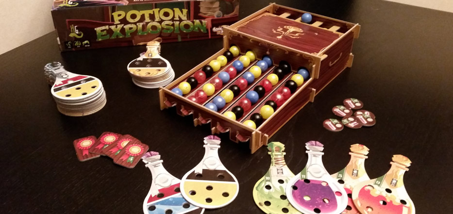
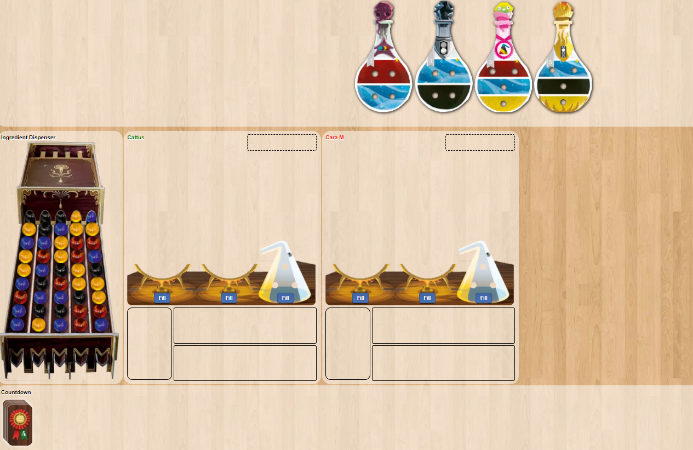

# ASG-01 : Exploding Lists

## _(aka BOOM, Baby!)_

**GitHub Link**: https://classroom.github.com/a/rMRYfboW

**DUE:** Feb 26 (F) by end of the day

**Late Policy:** why, that's [in the course outline](https://github.com/MRU-CSIS-2503-202101-001/course-resources#assignments-1)

**Submissions:** just like with drills

## Preamble

I play the game [Potion Explosion](https://www.horribleguild.com/potion-explosion/) a lot:

Well, to be more precise, I play _this_ version on [Board Game Arena](https://boardgamearena.com/welcome) a lot:

I've been losing a lot recently - I'm sure it's not my fault - and I thought it would be neat (if not entirely ethical) to create a tool to help me make better plays. Actually, to be precise again, I thought it would be neat for YOU to create such a tool. 

This assignment is the first step in that direction. We will take a second (and final) step in assignment 2.

## Skills Covered

This assignment will require you to have a variety of skills from 1501 and 1502, including, but not restricted to:

- [ ] dealing with file input.
- [ ] handling and creating your own exceptions.
- [ ] creating and using copy constructors.
- [ ] generating random numbers.
- [ ] creating valid Javadoc.

In addition, you will need to:

- [ ] implement an inline Comparator.
- [ ] make an array-backed Stack implementation. (This also implicitly covers basically all the arrays skills you are expected to show as well.)
- [ ] make a linked-list-backed Queue implementation.
- [ ] make a class implement a single Java interface.
- [ ] make a class implement more than one Java interface.
- [ ] use these basic features of `Optional`: `get`, `of`, and `empty`?.

Finally, you will find this assignment requires:

- effective use of your editor, including the debugger.
- the ability to take a large task and work on it gradually over a period of time. Attempts to do this assignment at the last minute will fail.
- careful reading of these instructions and the documentation present in the starting code.

## A Quick (Optional) Plug-in Install

If you want to see the colored text version of the app in the console, you'll need to install the **ANSI Escape in Console** plug-in. (You install this like you did  the Checkstyle and PMD plug-ins; through Help > Eclipse Marketplace.)

## So What Am I Supposed to DO, Man?!?

Here are my suggestions. These are not the only way to get this assignment done successfully. I still think they work pretty well, though:

1. First, skim through these instructions. Yup - **all** of them...but just skim. Give your brain a chance to get the lay of the land - that's all. If any questions pop into your mind while you're skimming, jot 'em down.
2. Even though we're only programming **one small part** of the game (the pulling of marbles from a marble column), and even though we're making numerous simplifications (like dealing with **one** column instead of **five**), you should understand the rules of the entire game. Fortunately, there are many ways you can learn about them in a painless fashion.   

    > _I would recommend watching [this video](https://youtu.be/iSODqRFNe3I) [12:18] from the Watch It Played team - they consistently do stellar work in explaining game rules, and this video is no exception._
3. Next, watch [this video](https://youtu.be/-bIqBK7WGuE) demoing a working version of this assignment. That way, you'll have a clear picture in your mind what your A-level destination is.
4. Take a look at [the rubric](rubric.md) so you know how marks are assigned. Notice how the rubric forces you to progress through the different test levels, from F+ all the way up to A+.
5. (Optional) If you're working on a team, you might want to start openly talking about such things as:
   1. what grade are you shooting for? Be honest and open with yourselves - not everyone's shooting for the A...and that's fine.
   2. how will you divvy up the work?
   3. what's your pace? 
   4. how will your team share code?
6. Finally, get to work! Start at the F+ level requirements in the overview section that follows, fulfill them, and keep moving up the grade scales!

## Overviews of Each Level

1. [F+ level](f-plus-level.md)
1. [D Level](d-level.md)
1. [D+ Level](d-plus-level.md)
1. [C Level](c-level.md)
1. [B Level](b-level.md)
1. [A- Level](a-minus-level.md)
1. [A Level](a-level.md)
1. [A+ Level](a-plus-level.md)

**YOU SHOULD PUSH YOUR WORK TO GITHUB AFTER YOU COMPLETE EVERY LEVEL - THAT WAY, YOU'LL HAVE BACKUPS OF YOUR WORK!!!**

## Before You Freak Out

- This is a large assignment - but you have more than four weeks to complete it (and I'm not including Reading Week in there, 'cause that's your week IMO).
- You can get started on this today if you wanted:
  - you already have the skills needed to do the F+, D, and D+ levels
  - the stack needed to complete the C level you'll be ready to tackle early next week (or earlier, if you do a little reading on your own in the online text).
  - by the second week in February, you'll have the remaining pieces of the puzzle and a good week and change to finish.
- You don't have to do any of the output work - all the graphical stuff has been done for you already.

