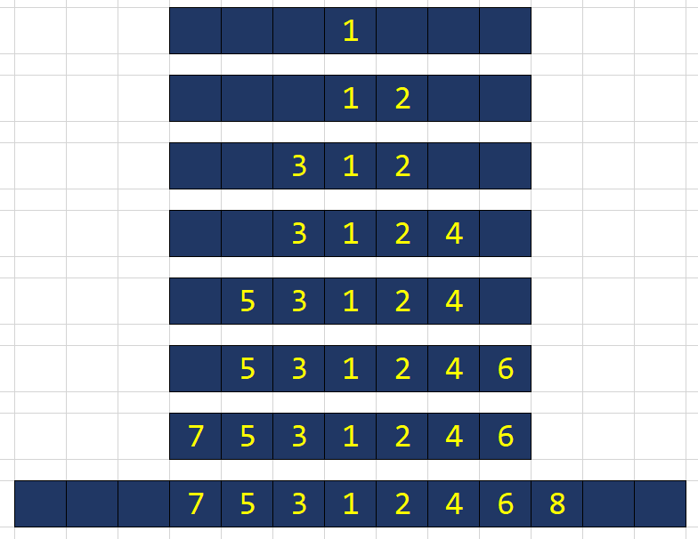

# Drill - Oscillating Resizable Array

_(aka Back and Forth and Back and Forth and...)_

Estimated completion time: 80 minutes

**Accept this project by going here:** https://classroom.github.com/a/AfZaTQXJ

## Preamble

This one's going out to all the oscillating fans out there.

You're going to make an array-backed class called `OscillatingResizableList` that you can add things to...but there are, of course, some wrinkles:

- the class will be generic
- the class must use an array under the hood (aka the backing array)
- the starting size of the backing array is 7
- when things are added, they happen in a special way: the first element goes in the **middle** of the backing array...and then subsequent additions happen at the ends of the current group of filled array elements, alternating right to left to right, etc.
- if an attempt to add to a full backing array happens, it resizes by 6 and the current contents of the backing array are moved to the middle of the new backing array.
- confused? A picture will help, I reckon. Here's what would would happen to the backing array if we created a new `OscillatingResizableList<Integer>` and added the numbers 1 through 8 to it:

## Special Warning

As mentioned in the [More generics screencast](https://youtu.be/FLVZzE-Rhn4?t=142), I've decided to turn some compiler warnings back on, so you're going to see extra warnings show up (they'll be labelled as type`Java Problem`). **These warnings have no effect on your mark - I only care about the PMD and Checkstyle warnings.**

## Skills Covered

Show you can...

- [ ] create a class from scratch that uses generics.
- [ ] resize an array while keeping its contents.
- [ ] add items to an array.
- [ ] determine the methods to create for a class by the tests available for that class.
- [ ] determine the code to write by observing how a finished product works.

## Instructions

1. Complete the `OscillatingResizableList<T>` class that represents a list that you can add things to. The behaviour of this class is described in the [Preamble](#preamble):
   1. I've started things off for you, because dealing with generic arrays sucks and I didn't want you to suffer unduly.
   2. if all the `OscillatingResizableList` tests all pass, you can consider your `OscillatingResizableList` working okay!
2. Complete the `App.java` run method so that when you run `Main.java`, the program behaves as expected by the `MainTests`.  
     1. I've added a useful method in `App.java` that removes some of the drudgery.

Here is an example run of a working solution (user input in **bold**):

---
---

Hi! I'm the Oscillating Resizable List app!  
Please enter one integer per line.  
I will add that number to the list and then show you its contents.  

I will stop when you enter an empty line.  

Ready? Start entering numbers!  
\> **-12**  
contents: [null, null, null, -12, null, null, null]

\> **45**  
contents: [null, null, null, -12, 45, null, null]

\> **999**  
contents: [null, null, 999, -12, 45, null, null]

\>   
Done now! Thanks!

---
---

## Hints

- don't just jump into this one...you're gonna wanna think about your plan of attack a bit here - draw some pictures! (It sure helped me.)
- don't resize the backing array until someone tries to add something and there's no room...resizing is an expensive operation, so we don't want to do it unless absolutely necessary!